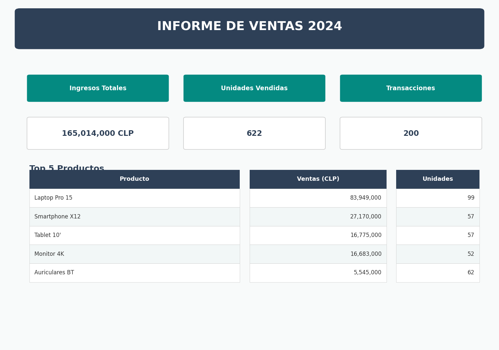
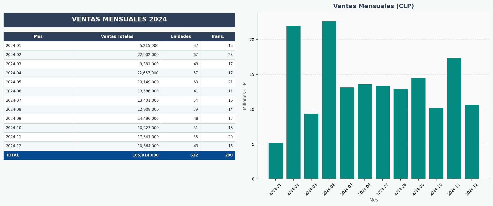

# Excel Sales Automation


A Python automation pipeline that processes raw sales data and generates a fully formatted, multi-sheet Excel report with charts — no manual work in Excel required.

**The problem it solves:** Sales teams receive raw transaction exports that must be cleaned, aggregated, and formatted into a management report every month. This pipeline automates the entire flow in seconds.

---

## What it generates

A 4-sheet Excel workbook:

| Sheet | Content |
|---|---|
| **Resumen Ejecutivo** | KPI cards (revenue, units, transactions) + Top 5 products mini-table |
| **Ventas Mensuales** | Month-by-month breakdown table + bar chart |
| **Top Productos** | Top 5 products ranked by revenue |
| **Por Vendedor** | Performance table per seller |

### Report preview




---

## How it works

```
ventas.xlsx (raw data)
        │
        ▼
  clean_data()        ← drops nulls, removes invalid rows, adds period columns
        │
        ▼
   analyze()          ← aggregations: monthly, top products, by seller, by region
        │
        ▼
 generate_report()    ← openpyxl: formatting, merged cells, number formats, chart
        │
        ▼
informe_ventas_2024.xlsx
```

---

## Quickstart

```bash
# 1. Clone and enter the repo
git clone https://github.com/Arcan17/excel-automation.git
cd excel-automation

# 2. Create and activate virtual environment
python -m venv .venv
source .venv/bin/activate   # Windows: .venv\Scripts\activate

# 3. Install dependencies
pip install -r requirements.txt

# 4. Run
python src/main.py
```

The report is written to `reports/informe_ventas_2024.xlsx`.

To use your own data, replace `data/ventas.xlsx` with a file that has columns:
`Fecha`, `Producto`, `Vendedor`, `Region`, `Precio_Unitario`, `Cantidad`, `Total`.

---

## Project structure

```
excel-automation/
├── src/
│   ├── data_generator.py   # Generates sample sales data for demo/testing
│   ├── processor.py        # Data cleaning and analysis (SalesSummary dataclass)
│   ├── report_generator.py # Excel report builder (openpyxl)
│   └── main.py             # Entry point
├── tests/
│   └── test_processor.py   # 16 unit tests for processor module
├── data/                   # Input data (ventas.xlsx)
├── reports/                # Generated reports
├── requirements.txt
└── .github/workflows/ci.yml
```

---

## Running tests

```bash
pytest tests/ -v
```

Expected output:

```
tests/test_processor.py::test_clean_data_returns_dataframe PASSED
tests/test_processor.py::test_clean_data_drops_nulls PASSED
tests/test_processor.py::test_clean_data_removes_non_positive_totals PASSED
tests/test_processor.py::test_clean_data_adds_mes_column PASSED
tests/test_processor.py::test_clean_data_fecha_is_datetime PASSED
tests/test_processor.py::test_analyze_returns_summary PASSED
tests/test_processor.py::test_total_revenue_positive PASSED
tests/test_processor.py::test_total_units_positive PASSED
tests/test_processor.py::test_total_transactions_matches_row_count PASSED
tests/test_processor.py::test_avg_transaction_is_mean PASSED
tests/test_processor.py::test_monthly_sales_has_required_columns PASSED
tests/test_processor.py::test_monthly_sales_revenue_sum_matches_total PASSED
tests/test_processor.py::test_top_products_has_at_most_5_rows PASSED
tests/test_processor.py::test_top_products_sorted_descending PASSED
tests/test_processor.py::test_sales_by_seller_covers_all_sellers PASSED
tests/test_processor.py::test_sales_by_region_covers_all_regions PASSED

16 passed in 0.24s
```

---

## Tech stack

| Layer | Technology |
|---|---|
| Data processing | pandas 2.x |
| Excel generation | openpyxl 3.x |
| Testing | pytest |
| CI/CD | GitHub Actions |

---

## License

MIT
